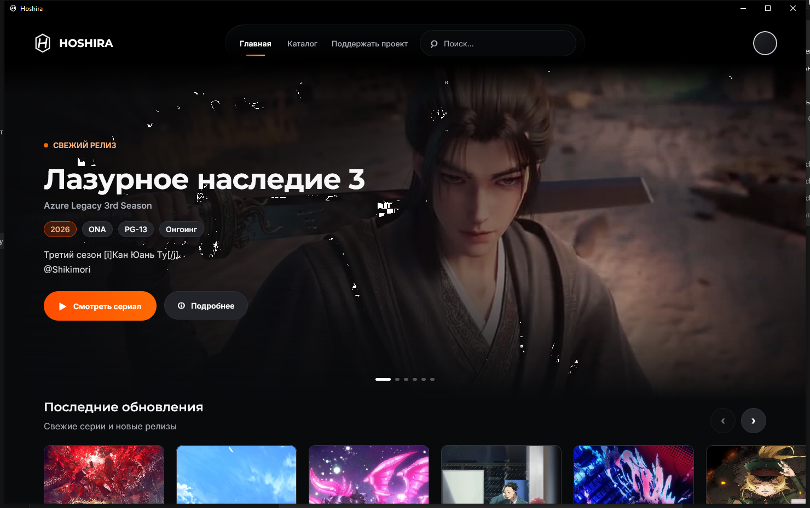

<div align="center">
  
  <h1>Hoshira</h1>
  <p><strong>Современный desktop-клиент для вашей аниме-библиотеки.</strong></p>
  <p>Каталог, поиск, персональные списки и просмотр — в едином desktop-интерфейсе.</p>

  <p>
    <a href="README.md">Русский</a>
    ·
    <a href="README.en.md">English</a>
  </p>

  <p>
    
    
    
    
    
    
    
  </p>
</div>

<p align="center">
  
</p>

## О продукте

Hoshira — независимое desktop-приложение с фокусом на быстрый доступ к каталогу,
персональной библиотеке и просмотру эпизодов. Интерфейс спроектирован как
полноценный desktop-продукт: с кинематографичной главной страницей, плавными
переходами, системным установщиком и единым визуальным языком.

Основная версия — **desktop beta для Windows x64**. Linux x64 доступен как
экспериментальная сборка: интерфейс, каталог и аккаунт используют общий код,
а окно, хранилище сессии и браузерный плеер имеют отдельные реализации.

> **Мобильная beta Hoshira находится в активной разработке.**
> Исходный код Android-приложения расположен в модуле `androidApp`.
> Интерфейсы, возможности и формат сборок пока могут изменяться.

## Возможности

| Раздел | Что доступно |
| --- | --- |
| Главная | Ротация актуальных релизов, подборки и горизонтальные карусели |
| Каталог | Бесконечная подгрузка, фильтры и сортировка |
| Поиск | Поиск по каталогу с задержкой ввода и обработкой ошибок |
| Страница аниме | Баннер, метаданные, жанры, студии озвучки и эпизоды |
| Плеер | WebView2 на Windows, WebKitGTK на Linux, выбор источника и качества, собственные элементы управления |
| Аккаунт | Авторизация YummyAnime, избранное и пользовательские списки |
| Desktop UX | Кэш изображений, тёмное окно, загрузочные экраны и фирменный установщик |

## Системные требования

### Для запуска установленного приложения

- Windows 10 или Windows 11, x64;
- Microsoft Edge WebView2 Runtime — при отсутствии установщик добавит
  официальный Evergreen Runtime от Microsoft;
- подключение к интернету.

JVM поставляется вместе с desktop-дистрибутивом и отдельно пользователю не нужна.

### Экспериментальная версия для Linux

- Ubuntu 22.04/24.04 либо совместимый x64-дистрибутив;
- пакет `.deb` или `.rpm` из артефактов GitVerse CI/CD;
- WebKitGTK и мультимедийные плагины GStreamer;
- подключение к интернету.

Linux-версия использует системный WebKitGTK и GStreamer, поэтому отдельный
Chromium-пакет не скачивается. На Ubuntu необходимые мультимедийные компоненты
можно установить командой:

```bash
sudo apt install libwebkit2gtk-4.1-0 gstreamer1.0-plugins-base \
  gstreamer1.0-plugins-good gstreamer1.0-plugins-bad \
  gstreamer1.0-plugins-ugly gstreamer1.0-libav
```

Для Ubuntu 22.04 вместо `libwebkit2gtk-4.1-0` используется
`libwebkit2gtk-4.0-37`.

## Структура проекта

```text
androidApp/                 # мобильная beta Hoshira для Android
desktopApp/
├─ installer/             # фирменная оболочка установщика
├─ src/main/kotlin/       # приложение, API, состояние и UI
├─ src/windowsMain/       # DPAPI, пути и Windows-интеграция
├─ src/linuxMain/         # Linux-пути, хранилище и WebKitGTK-плеер
├─ src/main/resources/    # иконки и нативный WebView2 loader
├─ src/test/              # unit-тесты
└─ tools/                 # сборочные инструменты Windows
docs/
├─ ARCHITECTURE.md
└─ assets/
third_party/              # тексты лицензий сторонних компонентов
```

Подробности: [архитектура проекта](docs/ARCHITECTURE.md).

## Технологии

- Kotlin/JVM 21;
- Compose Multiplatform Desktop;
- Kotlin Coroutines и Serialization;
- Coil 3 для изображений и дискового кэша;
- JNA и Microsoft WebView2 для нативной интеграции с Windows;
- Eclipse SWT, WebKitGTK и GStreamer для экспериментального Linux-плеера;
- Gradle Wrapper;
- WiX/jpackage и собственная C#-оболочка установщика.

## Безопасность и конфиденциальность

- приложение не отправляет учётные данные на собственный сервер Hoshira;
- сетевые запросы аккаунта направляются непосредственно API-провайдеру;
- пароль не сохраняется;
- сессия защищается Windows DPAPI либо локальным AES-GCM-хранилищем Linux
  с ключом, доступным только текущему пользователю;
- секреты и signing-материалы исключены из Git.

Если вы обнаружили уязвимость, не публикуйте чувствительные детали в открытом
issue — свяжитесь с владельцем репозитория через профиль GitVerse.

## Правовой статус

Hoshira — неофициальный независимый клиент. Проект не связан и не аффилирован
с владельцами Yani/YummyAnime, Microsoft WebView2 или внешними
видеопровайдерами. Приложение не хранит и не распространяет медиаконтент:
доступность каталога и воспроизведения зависит от сторонних сервисов, региона
пользователя и их условий использования.

Товарные знаки и материалы третьих лиц принадлежат соответствующим владельцам.

## Лицензирование

Copyright © 2026 northqw. Все права защищены.

Исходный код опубликован исключительно для ознакомления и изучения. Его
использование, копирование, изменение и распространение без предварительного
письменного разрешения правообладателя запрещены. Полные условия приведены в
файле [LICENSE](LICENSE).

Сторонние компоненты и материалы регулируются собственными лицензиями.
Соответствующие уведомления находятся в `third_party/`.
